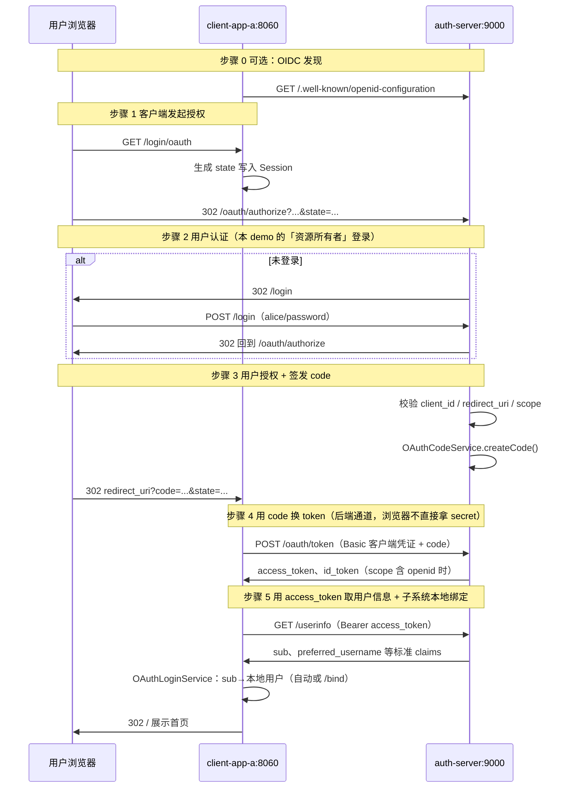

# OAuth2 手写演示（auth-server + client-app-a + client-app-b）

本仓库包含三套实现：

| 模块 | 说明 |
|------|------|
| **custom-oauth-demo**（auth-server + client-app-a + client-app-b） | 不依赖 Spring Authorization Server，手写 OAuth2 授权码 + 部分 OIDC + 多 RP SSO 门户 |
| **spring-security-oauth-demo**（oauth-server + oauth-client + oauth-resource） | 基于 Spring Authorization Server / OAuth2 Client / Resource Server 的标准集成 |
| **sa-token-oauth-sso-demo**（auth-center + system-a + system-b） | Sa-Token OAuth2 认证中心 + 多系统 SSO + 遗留系统绑定，详见 [sa-token-oauth-sso-demo/README.md](sa-token-oauth-sso-demo/README.md) |

**本文档以 `custom-oauth-demo` 为主线**（auth-server + client-app-a + client-app-b），便于对照 RFC 6749 理解 OAuth 协议与子系统本地绑定。详细调用链路与阅读顺序见下文 [架构分层](#架构分层先建立全局图景)、[代码调用链路](#代码调用链路)、[推荐阅读顺序](#推荐阅读顺序)。

---

## 快速运行

```bash
# 终端 1：授权服务器（端口 9000）
mvn -pl custom-oauth-demo/auth-server spring-boot:run

# 终端 2：客户端 A（端口 8060）
mvn -pl custom-oauth-demo/client-app-a spring-boot:run

# 终端 3：客户端 B（端口 8061，SSO 演示）
mvn -pl custom-oauth-demo/client-app-b spring-boot:run
```

浏览器访问 http://localhost:8060/ ，点击 OAuth 登录。

| 角色 | 地址 | 演示账号 |
|------|------|----------|
| 授权服务器 / 统一门户 | http://localhost:9000 / http://localhost:9000/portal | 用户 `alice` / `password`，`bob` / `password` |
| 客户端 A | http://localhost:8060 | client_id `demo-client`，secret `demo-secret` |
| 客户端 B | http://localhost:8061 | client_id `demo-client-b`，secret `demo-secret-b` |

### SSO 与本地用户绑定（custom-oauth-demo）

认证中心只负责统一身份（`sub`）；**本地用户与 OAuth 绑定在各子系统内完成**。

1. 在 **系统 A**（http://localhost:8060）OAuth 登录 `alice` → 自动绑定本地用户 `U10001`。
2. 打开 **统一门户** http://localhost:9000/portal ，点击「进入系统 B」→ SSO 跳过密码页。
3. **预期**：B 首页显示本地用户 `U20001`（与 A 的 `U10001` 不同，同一 `sub` 在不同子系统映射不同本地账号）。
4. 在门户用 `bob` 登录后进 **系统 B** → 跳转 `/bind`，输入本地 `bob_local` / `password` 完成绑定。
5. 门户「退出统一认证」后再进 B 需重新输入密码；A/B「退出登录」仅清本系统 Session。

---

## OAuth2 授权码流程（总览）



---

## 架构分层（先建立全局图景）

```
┌─────────────────────────────────────────────────────────────┐
│  auth-server :9000（认证中心 / IdP）                          │
│  职责：统一登录、发 code/token、返回 OIDC 标准 claims           │
│  数据：User(alice/bob)、OAuthClient、code、access_token        │
│  Session：LOGIN_USER（IdP 登录态，SSO 靠它）                   │
└───────────────────────────┬─────────────────────────────────┘
                            │ OAuth2 授权码 + OIDC
            ┌───────────────┴───────────────┐
            ▼                               ▼
┌───────────────────────┐       ┌───────────────────────┐
│ client-app-a :8060    │       │ client-app-b :8061    │
│ 职责：RP + 本地用户绑定 │       │ 同上 + /bind 手动绑定  │
│ 数据：LocalUser、      │       │ 本地：alice→U20001、   │
│       OAuthUserLink   │       │       bob_local→U20002 │
│ Session：CLIENT_*     │       │ Session：CLIENT_B_*   │
└───────────────────────┘       └───────────────────────┘
```

| 概念 | 存在位置 | 示例 |
|------|----------|------|
| 统一身份 `sub` | auth-server 签发，经 UserInfo 传给子系统 | `sub=1`（alice） |
| IdP Session | auth-server `LOGIN_USER` | Portal SSO 跳过密码页 |
| 本地业务用户 | 各子系统 `LocalUserRepository` | A: `U10001`，B: `U20001` |
| OAuth 绑定 | 各子系统 `OAuthUserLinkRepository` | `sub=1` → 本地用户 ID |
| 客户端登录态 | 各子系统 `ClientLoginSession` | OIDC 身份 + 本地用户 + token |

---

## OAuth2 / OIDC 步骤与代码对照

| 步骤 | RFC / OIDC 含义 | 谁发起 | HTTP | 核心代码 |
|------|-----------------|--------|------|----------|
| 0 | OIDC Provider 元数据（可选） | 客户端 | `GET /.well-known/openid-configuration` | `OpenIdConfigurationController` |
| 1 | 引导资源所有者授权 | 客户端 | `GET /login/oauth` → 302 授权端点 | `OAuthLoginController` → `OAuthAuthorizeUrlBuilder` |
| 1b | 授权请求 | 浏览器 | `GET /oauth/authorize?response_type=code&...` | `OAuthAuthorizeController#authorize` |
| 2 | 资源所有者身份认证 | 浏览器 | `GET/POST /login` | `LoginController` → `LoginService` |
| 2b | SSO 统一门户（可选入口） | 浏览器 | `GET /portal` → 302 各系统 `/login/oauth` | `PortalController` → `PortalAppRepository` |
| 3 | 签发 authorization code | 授权服务器 | 302 `redirect_uri?code=&state=` | `OAuthAuthorizeController` → `OAuthCodeService` |
| 4 | 用 code 换 token | 客户端后端 | `POST /oauth/token` | 客户端 `OAuthTokenService`；服务端 `OAuthTokenController` → `AccessTokenService` |
| 5 | 用 token 取 UserInfo | 客户端后端 | `GET /userinfo` + Bearer | 客户端 `UserInfoService`；服务端 `UserInfoController` |
| 5b | **子系统本地用户绑定** | 客户端后端 | （无对外 HTTP，内存查表） | `OAuthLoginService.handleCallback` |
| 5c | 手动绑定（仅 B） | 浏览器 | `GET/POST /bind` | `BindController` → `OAuthLoginService.bind` |
| 6 | 展示 / 登出 | 浏览器 | `GET /`、`POST /logout` | `HomeController` |

**本 demo 未实现**：refresh_token、consent 授权确认页、PKCE、token 撤销、标准 `/oauth2/*` 路径、OIDC `prompt=none`、跨系统单点登出联动。

**已实现**：授权码 + 部分 OIDC、IdP Session SSO、统一门户、多 RP、**子系统内本地用户绑定**（B 含手动绑定）。

---

## 代码调用链路

建议边跑边在 IDE 里对下列方法下断点。三条路径共用 **步骤 1～5**，差异在 **5b / 5c**。

### 链路 A：从系统 A 直接 OAuth 登录（alice，首次）

适用：http://localhost:8060 →「使用 DemoAuth 登录」

```
[浏览器] GET /login/oauth
│
├─ [8060] OAuthLoginController.oauthLogin
│     ├─ OAuthAuthorizeUrlBuilder.newState()          → state 写入 Session(OAUTH_STATE)
│     └─ OAuthAuthorizeUrlBuilder.buildAuthorizeUrl → 302 auth-server /oauth/authorize
│
├─ [浏览器] GET :9000/oauth/authorize?client_id=demo-client&redirect_uri=8060/callback&...
│
├─ [9000] OAuthAuthorizeController.authorize
│     ├─ session.getAttribute(LOGIN_USER) == null ?
│     │     ├─ 是 → session.setAttribute(OAUTH_PENDING, url) → 302 /login
│     │     │     └─ LoginController.login → LoginService.authenticate → LOGIN_USER=alice
│     │     │           → 302 回到 /oauth/authorize（或 /portal，视 pending 有无）
│     │     └─ 否 → 继续
│     ├─ OAuthClientService.validateRedirectUri / validateScopes
│     └─ OAuthCodeService.createCode(userId=1) → 302 :8060/callback?code&state
│
├─ [8060] CallbackController.callback
│     ├─ 校验 Session.state == 回调 state
│     ├─ OAuthTokenService.exchangeCode(code)
│     │     └─ [9000] OAuthTokenController.token
│     │           ├─ OAuthCodeService.validateForToken + markUsed
│     │           └─ AccessTokenService.createToken → access_token + id_token
│     ├─ UserInfoService.fetchUserInfo(access_token)
│     │     └─ [9000] UserInfoController.userinfo → { sub, preferred_username, name }
│     ├─ OAuthLoginService.handleCallback
│     │     ├─ OAuthUserLinkRepository.findByOidcSub("1") → 空（首次）
│     │     ├─ LocalUserRepository.findByUsername("alice") → U10001
│     │     └─ OAuthUserLinkRepository.save(sub=1 → localId=1001)
│     └─ session.setAttribute(CLIENT_LOGIN) → 302 /
│
└─ [8060] HomeController.home → index.html（sub=1, 本地 U10001）
```

### 链路 B：Portal SSO 进入系统 B（alice，已 IdP 登录）

适用：A 或 Portal 已登录 alice → http://localhost:9000/portal →「进入系统 B」

```
[浏览器] GET :8061/login/oauth          ← PortalAppRepository 配置的入口 URL
│
├─ [8061] OAuthLoginController.oauthLogin（同链路 A 的步骤 1）
│
├─ [9000] OAuthAuthorizeController.authorize
│     └─ LOGIN_USER 已有 → 跳过 /login，直接 createCode(client=demo-client-b)
│           → 302 :8061/callback?code&state
│
├─ [8061] CallbackController.callback（步骤 4、5 同 A，client_id 不同）
│     └─ OAuthLoginService.handleCallback
│           ├─ findByOidcSub("1") → 空（B 的绑定表独立，与 A 不共享）
│           ├─ findByUsername("alice") → U20001
│           └─ save(sub=1 → localId=2001)
│
└─ [8061] HomeController.home → 本地 U20001（同一 sub，不同本地用户）
```

要点：**IdP Session 在 9000 共享；OAuthUserLink 在 8060 / 8061 各自维护。**

### 链路 C：系统 B 手动绑定（bob → bob_local）

适用：Portal 用 bob 登录 → 进入系统 B

```
… 步骤 1～5 同上，UserInfo 返回 sub=2, preferred_username=bob …
│
├─ [8061] OAuthLoginService.handleCallback
│     ├─ findByOidcSub("2") → 空
│     ├─ findByUsername("bob") → 空（本地只有 bob_local，不同名）
│     └─ return NeedBind → session(PENDING_OAUTH_BIND)
│           → 302 /bind
│
├─ [8061] BindController.bindPage → bind.html
│
├─ [8061] BindController.bindSubmit
│     └─ OAuthLoginService.bind(sub, …, "bob_local", "password")
│           ├─ LocalUserRepository 校验本地账号
│           ├─ OAuthUserLinkRepository.save(sub=2 → localId=2002)
│           └─ session.setAttribute(CLIENT_LOGIN) → 302 /
│
└─ [8061] HomeController.home → 本地 U20002（bob_local）
```

### 链路 D：再次登录（sub 已绑定）

`OAuthLoginService.handleCallback` 第一步 `findByOidcSub` 命中 → 直接 `LoggedIn`，不再走自动绑定或 `/bind`。

---

## 推荐阅读顺序

按「先跟通协议，再理解绑定，最后看 SSO 差异」阅读；**每一轮只打开一个模块**，避免跳文件。

### 第 0 步：配置对齐（5 分钟）

| 顺序 | 文件 | 关注点 |
|------|------|--------|
| 1 | `auth-server/.../ClientRepository.java` | 注册的 client_id、redirect_uri 白名单 |
| 2 | `client-app-a/.../application.yml` | `demo-client`、8060/callback、9000 地址 |
| 3 | `client-app-b/.../application.yml` | `demo-client-b`、8061/callback |

三者 `client_id` / `redirect_uri` / `scope` 必须一致，否则步骤 3 或 4 失败。

---

### 第 1 步：OAuth 协议主链路（建议用系统 A 跟断点）

**目标**：理解 RFC 6749 授权码模式，暂时不管本地用户。

| 顺序 | 模块 | 文件 | 说明 |
|------|------|------|------|
| 1 | client-a | `OAuthClientProperties` | 客户端身份与 endpoints |
| 2 | client-a | `OAuthLoginController` | 流程入口，state + 302 |
| 3 | client-a | `OAuthAuthorizeUrlBuilder` | 如何拼 `/oauth/authorize` |
| 4 | auth | `OAuthAuthorizeController` | 校验 client、发 code |
| 5 | auth | `LoginController` + `LoginService` | 未登录时跳登录；`OAUTH_PENDING` |
| 6 | auth | `OAuthCodeService` | code 一次性、绑定 user/client/redirect_uri |
| 7 | client-a | `CallbackController` | 回调入口（先看 state 校验 + 串联调用） |
| 8 | client-a | `OAuthTokenService` | POST `/oauth/token`，Basic 传 secret |
| 9 | auth | `OAuthTokenController` + `AccessTokenService` | 验 code、签发 token / id_token |
| 10 | client-a | `UserInfoService` | GET `/userinfo` |
| 11 | auth | `UserInfoController` | 只返回 sub 等标准 claims |
| 12 | client-a | `HomeController` | 读 Session 渲染页面 |

**可选**：`OpenIdConfigurationController`（OIDC 发现，与主链路独立）。

---

### 第 2 步：子系统本地用户绑定

**目标**：理解「认证身份 ≠ 业务用户」，绑定在 RP 侧完成。

| 顺序 | 模块 | 文件 | 说明 |
|------|------|------|------|
| 1 | client-a | `LocalUserRepository` | 系统 A 本地用户表（U10001） |
| 2 | client-a | `OAuthUserLinkRepository` | sub → localUserId |
| 3 | client-a | `OAuthLoginService` | 查绑定 → 用户名自动绑定 → NoLocalUser |
| 4 | client-a | `CallbackController` | 回调里调用 `handleCallback` 的位置 |
| 5 | client-a | `ClientLoginSession` + `index.html` | 同时展示 OIDC 与本地用户 |

然后 **对照读 client-b**（结构相同，数据不同）：

| 顺序 | 模块 | 文件 | 说明 |
|------|------|------|------|
| 6 | client-b | `LocalUserRepository` | alice + bob_local |
| 7 | client-b | `OAuthLoginService` | 多了 `NeedBind` 分支 |
| 8 | client-b | `BindController` + `bind.html` | bob 手动绑定 bob_local |

---

### 第 3 步：SSO 与门户

**目标**：理解 IdP Session 与子系统 Session 分离。

| 顺序 | 模块 | 文件 | 说明 |
|------|------|------|------|
| 1 | auth | `UserRepository` | 认证中心用户 alice / bob |
| 2 | auth | `LoginController` | `LOGIN_USER` 写入时机 |
| 3 | auth | `PortalController` + `portal.html` | 门户展示与全局登出 |
| 4 | auth | `PortalAppRepository` | 系统 A/B 入口 URL |
| 5 | auth | `OAuthAuthorizeController` | 已登录则跳过 `/login`（SSO 关键） |

**验证顺序**：链路 A（A 登录）→ 链路 B（Portal 进 B，无密码）→ 链路 C（bob 绑定）。

---

### 第 4 步：支撑层速查（按需）

**auth-server**

| 包 | 职责 |
|----|------|
| `controller/` | OAuth 端点 + 登录页 + 门户 |
| `service/` | code/token 生命周期、client 校验、JWT id_token |
| `repository/` | 内存：User、Client、Code、Token |
| `model/` | `OAuthCode`、`AccessToken`、`User` |
| `util/` | URL 拼接、Basic 解码、随机 token、JWT |

**client-app-a / b**

| 包 | 职责 |
|----|------|
| `controller/` | OAuth 入口、回调、首页；（B）绑定页 |
| `service/` | 授权 URL、换票、UserInfo、**本地绑定** |
| `repository/` | **LocalUser**、**OAuthUserLink** |
| `model/` | `UserInfo`、`ClientLoginSession` |
| `config/` | `OAuthClientProperties`、`RestClientConfig` |

---

### 第 5 步：与框架实现对比（可选）

阅读 `spring-security-oauth-demo` 的 `AuthorizationServerConfig`、`RegisteredClientsConfig`：同一协议由框架注册 `/oauth2/authorize`、`/oauth2/token`，无需手写 Controller；本地用户绑定仍需在业务系统自行实现（可参考本 demo 的 `OAuthLoginService`）。

---

## 目录结构（手写部分）

```
custom-oauth-demo/auth-server/        # 授权服务器 :9000
└── src/main/java/com/demo/manual/auth/
    ├── controller/
    │   ├── LoginController.java          # 步骤 2：用户登录
    │   ├── PortalController.java         # SSO：统一登录门户 /portal
    │   ├── OAuthAuthorizeController.java # 步骤 1b、3：/oauth/authorize
    │   ├── OAuthTokenController.java     # 步骤 4：/oauth/token
    │   ├── UserInfoController.java       # 步骤 5：/userinfo
    │   └── OpenIdConfigurationController.java  # 步骤 0
    ├── service/                        # code / token / 客户端校验
    └── repository/                     # 内存 demo 数据

custom-oauth-demo/client-app-a/         # OAuth 客户端 A :8060
└── src/main/java/com/demo/manual/client/
    ├── controller/
    │   ├── OAuthLoginController.java
    │   ├── CallbackController.java
    │   └── HomeController.java
    ├── service/
    │   ├── OAuthLoginService.java      # sub ↔ 本地用户绑定
    │   ├── OAuthAuthorizeUrlBuilder.java
    │   ├── OAuthTokenService.java
    │   └── UserInfoService.java
    ├── repository/
    │   ├── LocalUserRepository.java    # 本地用户表
    │   └── OAuthUserLinkRepository.java  # oauth 绑定表
    └── model/
        └── LocalUser / OAuthUserLink / ClientLoginSession

custom-oauth-demo/client-app-b/       # OAuth 客户端 B :8061
└── src/main/java/com/demo/manual/client/
    ├── controller/
    │   ├── OAuthLoginController.java
    │   ├── CallbackController.java
    │   ├── BindController.java         # 手动绑定（bob → bob_local）
    │   └── HomeController.java
    ├── service/                        # 同 A，OAuthLoginService 含 NeedBind
    ├── repository/                     # LocalUser（alice + bob_local）
    └── resources/templates/
        ├── index.html
        └── bind.html
```

### Session 键速查

| 应用 | Session 键 | 含义 |
|------|------------|------|
| auth-server | `LOGIN_USER` | IdP 已登录用户（User） |
| auth-server | `OAUTH_PENDING` | 登录前要完成的授权 URL |
| client-a/b | `OAUTH_STATE` | OAuth CSRF 防护 |
| client-a/b | `CLIENT_LOGIN` | 本系统登录态（ClientLoginSession） |
| client-b | `PENDING_OAUTH_BIND` | 待手动绑定的 OAuth 中间态 |

---

## 配置要点（各端必须一致）

| 配置项 | auth-server | client-app-a (A) | client-app-b (B) |
|--------|-------------|----------------|------------------|
| redirect_uri | `ClientRepository` 白名单 | `manual.oauth.redirect-uri` | 同上 |
| client_id / secret | `demo-client` / `demo-secret` | `application.yml` 同名 | `demo-client-b` / `demo-secret-b` |
| 授权端点 | `/oauth/authorize` | `auth-server-base-url` + 路径 | 同上 |
| scope | 客户端注册的 `openid profile` | `manual.oauth.scope` | 同上 |

`redirect_uri`、`client_id`、`state` 任一不匹配都会导致授权或换票失败，这是 OAuth2 设计的一部分。

---

## Sa-Token OAuth SSO（第三套）

```bash
# 终端 1：认证中心 :9100
mvn -pl sa-token-oauth-sso-demo/auth-center spring-boot:run

# 终端 2：系统 A :9201
mvn -pl sa-token-oauth-sso-demo/system-a spring-boot:run

# 终端 3：系统 B :9202
mvn -pl sa-token-oauth-sso-demo/system-b spring-boot:run
```

| 角色 | 地址 | 说明 |
|------|------|------|
| 认证中心 | http://localhost:9100 | `alice`/`password`、`bob`/`password` |
| 系统 A | http://localhost:9201 | 仅 OAuth 登录 |
| 系统 B | http://localhost:9202 | 本地 `bob_local`/`password` + OAuth + 账号绑定 |

**SSO 验证**：在 A 用 OAuth 登录后，打开 B 点「统一认证登录」，认证中心应不再要求输入密码。

---

## 相关文档

- 需求说明：`custom-prd.md`
- Sa-Token SSO：`sa-token-oauth-sso-demo/README.md`
- 标准参考：[RFC 6749 Authorization Code Grant](https://datatracker.ietf.org/doc/html/rfc6749#section-4.1)、[OpenID Connect Core](https://openid.net/specs/openid-connect-core-1_0.html)
