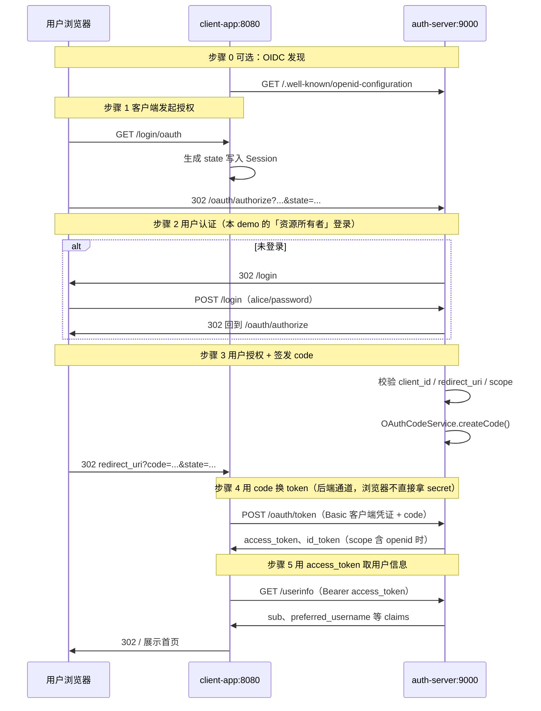

# OAuth2 手写演示（auth-server + client-app）

本仓库包含两套实现：

| 模块 | 说明 |
|------|------|
| **auth-server** + **client-app** | 不依赖 Spring Authorization Server，手写 OAuth2 授权码 + 部分 OIDC |
| oauth-server + oauth-client + oauth-resource | 基于 Spring Authorization Server / OAuth2 Client / Resource Server 的标准集成 |

**本文档以 `auth-server` + `client-app` 为主线**，便于对照 RFC 6749 理解每一步在代码中的位置。

---

## 快速运行

```bash
# 终端 1：授权服务器（端口 9000）
mvn -pl auth-server spring-boot:run

# 终端 2：客户端（端口 8080）
mvn -pl client-app spring-boot:run
```

浏览器访问 http://localhost:8080/ ，点击 OAuth 登录。

| 角色 | 地址 | 演示账号 |
|------|------|----------|
| 授权服务器 | http://localhost:9000 | 用户 `alice` / `password` |
| 客户端 | http://localhost:8080 | client_id `demo-client`，secret `demo-secret` |

---

## OAuth2 授权码流程（总览）



---

## OAuth2 / OIDC 步骤与代码对照

| 步骤 | RFC / OIDC 含义 | 谁发起 | HTTP | 核心代码 |
|------|-----------------|--------|------|----------|
| 0 | OIDC Provider 元数据（可选） | 客户端 | `GET /.well-known/openid-configuration` | `OpenIdConfigurationController` |
| 1 | 引导资源所有者授权 | 客户端 | `GET /login/oauth` → 302 授权端点 | `OAuthLoginController` → `OAuthAuthorizeUrlBuilder` |
| 1b | 授权请求 | 浏览器 | `GET /oauth/authorize?response_type=code&...` | `OAuthAuthorizeController#authorize` |
| 2 | 资源所有者身份认证（本 demo 用表单 Session） | 浏览器 | `GET/POST /login` | `LoginController` |
| 3 | 授权服务器签发授权码并重定向 | 授权服务器 | 302 `redirect_uri?code=&state=` | `OAuthAuthorizeController` → `OAuthCodeService` |
| 4 | 用授权码换取访问令牌 | 客户端后端 | `POST /oauth/token` | 客户端：`OAuthTokenService`；服务端：`OAuthTokenController` → `AccessTokenService` |
| 5 | 使用访问令牌访问受保护资源 | 客户端后端 | `GET /userinfo` + `Authorization: Bearer` | 客户端：`UserInfoService`；服务端：`UserInfoController` |
| — | 展示登录结果 / 登出 | 浏览器 | `GET /`、`POST /logout` | `HomeController` |

**本 demo 未实现**：refresh_token、授权确认页（consent）、PKCE、token 撤销、标准 `/oauth2/*` 路径（手写为 `/oauth/*`）。

---

## 一次完整请求的代码链路

按**时间顺序**跟踪（建议边跑边在 IDE 里对方法下断点）：

```
用户点击「OAuth 登录」
│
├─ [客户端] OAuthLoginController.oauthLogin
│     └─ OAuthAuthorizeUrlBuilder.newState / buildAuthorizeUrl
│
├─ [浏览器] GET http://localhost:9000/oauth/authorize?...
│
├─ [授权服] OAuthAuthorizeController.authorize
│     ├─ 未登录 → LoginController（SESSION_OAUTH_PENDING 保存原 URL）
│     │     └─ POST /login → LoginService → 302 回到 /oauth/authorize
│     ├─ OAuthClientService 校验 client / redirect_uri / scope
│     └─ OAuthCodeService.createCode → 302 http://localhost:8080/callback?code&state
│
├─ [客户端] CallbackController.callback
│     ├─ 比对 Session 中的 state 与回调 state
│     ├─ OAuthTokenService.exchangeCode → POST auth-server /oauth/token
│     │     └─ [授权服] OAuthTokenController → OAuthCodeService → AccessTokenService
│     ├─ UserInfoService.fetchUserInfo → GET auth-server /userinfo
│     │     └─ [授权服] UserInfoController → AccessTokenService
│     └─ Session 写入 token / userInfo → redirect /
│
└─ [客户端] HomeController.home → 渲染 index.html
```

---

## 推荐阅读顺序

### 第一轮：跟通一条 happy path（Controller → Service）

**客户端 client-app**

1. `OAuthClientProperties` + `application.yml` — 客户端 id、secret、redirect_uri、授权服地址  
2. `OAuthLoginController` — 流程入口  
3. `OAuthAuthorizeUrlBuilder` — 如何拼授权 URL  
4. `CallbackController` — 回调、state 校验、串联换票与拉用户信息  
5. `OAuthTokenService` — `authorization_code` 换 token  
6. `UserInfoService` — Bearer 调 `/userinfo`  
7. `HomeController` — 结果展示  

**授权服务器 auth-server**

1. `ClientRepository` / `UserRepository` — 演示用 client 与用户  
2. `LoginController` + `LoginService` — Session 登录与 `OAUTH_PENDING`  
3. `OAuthAuthorizeController` + `OAuthCodeService` — 发 code  
4. `OAuthTokenController` + `OAuthCodeService` + `AccessTokenService` — 换 token、签发 id_token  
5. `UserInfoController` — 校验 token 返回 claims  
6. `OpenIdConfigurationController` — OIDC 发现（独立阅读即可）  

### 第二轮：支撑层（按需）

| 包 | 作用 |
|----|------|
| `controller/` | HTTP 入口，对应 OAuth 协议端点或页面 |
| `service/` | 业务规则：校验、生成 code/token、JWT id_token |
| `repository/` | 内存存储 code、token、用户、客户端注册信息 |
| `model/` | `OAuthCode`、`AccessToken`、`User` 等数据结构 |
| `util/` | URL 拼接、Basic 解码、随机 token、JWT |

### 第三轮：与 Spring 标准实现的对比（可选）

阅读 `oauth-server` 的 `AuthorizationServerConfig`、`RegisteredClientsConfig`：同一协议由框架注册 `/oauth2/authorize`、`/oauth2/token` 等，**无需手写 Controller**。

---

## 目录结构（手写部分）

```
auth-server/                          # 授权服务器 :9000
└── src/main/java/com/demo/manual/auth/
    ├── controller/
    │   ├── LoginController.java          # 步骤 2：用户登录
    │   ├── OAuthAuthorizeController.java # 步骤 1b、3：/oauth/authorize
    │   ├── OAuthTokenController.java     # 步骤 4：/oauth/token
    │   ├── UserInfoController.java       # 步骤 5：/userinfo
    │   └── OpenIdConfigurationController.java  # 步骤 0
    ├── service/                        # code / token / 客户端校验
    └── repository/                     # 内存 demo 数据

client-app/                           # OAuth 客户端 :8080
└── src/main/java/com/demo/manual/client/
    ├── controller/
    │   ├── OAuthLoginController.java   # 步骤 1：发起授权
    │   ├── CallbackController.java     # 步骤 3 接收 code、4、5
    │   └── HomeController.java         # 展示结果
    ├── service/
    │   ├── OAuthAuthorizeUrlBuilder.java
    │   ├── OAuthTokenService.java
    │   └── UserInfoService.java
    └── config/
        └── OAuthClientProperties.java
```

---

## 配置要点（两端必须一致）

| 配置项 | auth-server | client-app |
|--------|-------------|------------|
| redirect_uri | `ClientRepository` 白名单 | `manual.oauth.redirect-uri` |
| client_id / secret | `demo-client` / `demo-secret` | `application.yml` 同名 |
| 授权端点 | `/oauth/authorize` | `auth-server-base-url` + 路径 |
| scope | 客户端注册的 `openid profile` | `manual.oauth.scope` |

`redirect_uri`、`client_id`、`state` 任一不匹配都会导致授权或换票失败，这是 OAuth2 设计的一部分。

---

## 相关文档

- 需求说明：`custom-prd.md`
- 标准参考：[RFC 6749 Authorization Code Grant](https://datatracker.ietf.org/doc/html/rfc6749#section-4.1)、[OpenID Connect Core](https://openid.net/specs/openid-connect-core-1_0.html)
