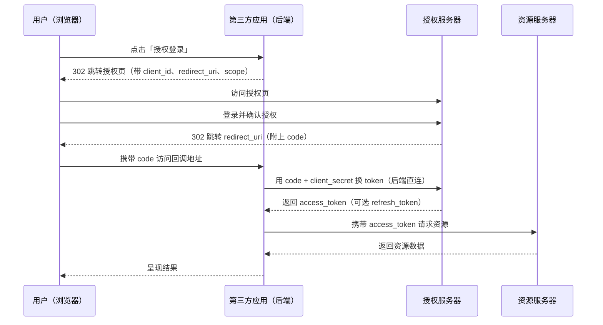
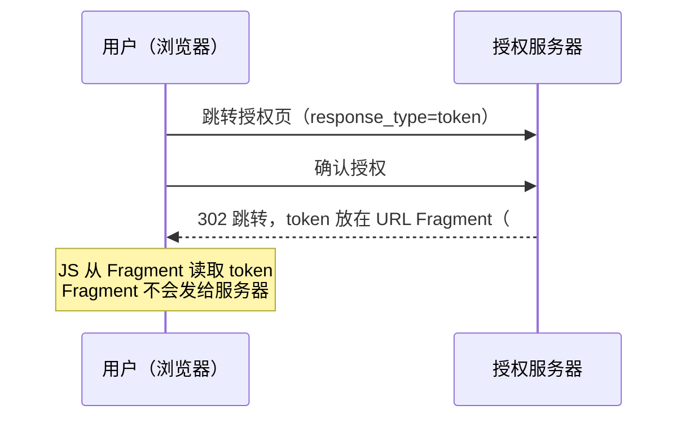
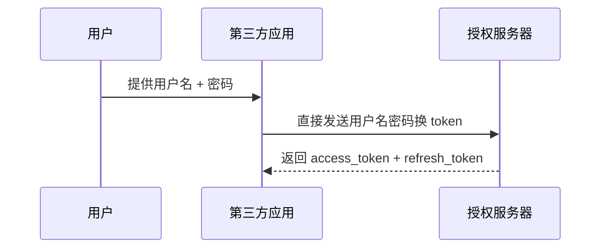
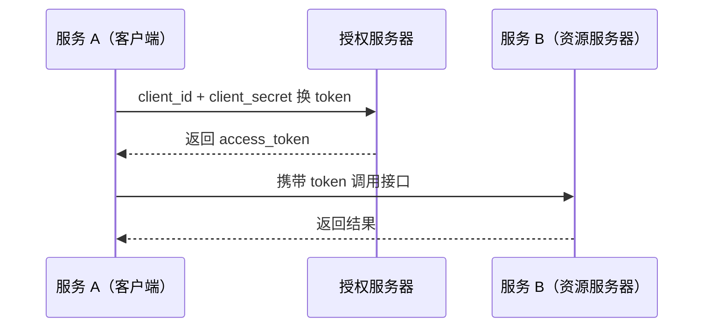
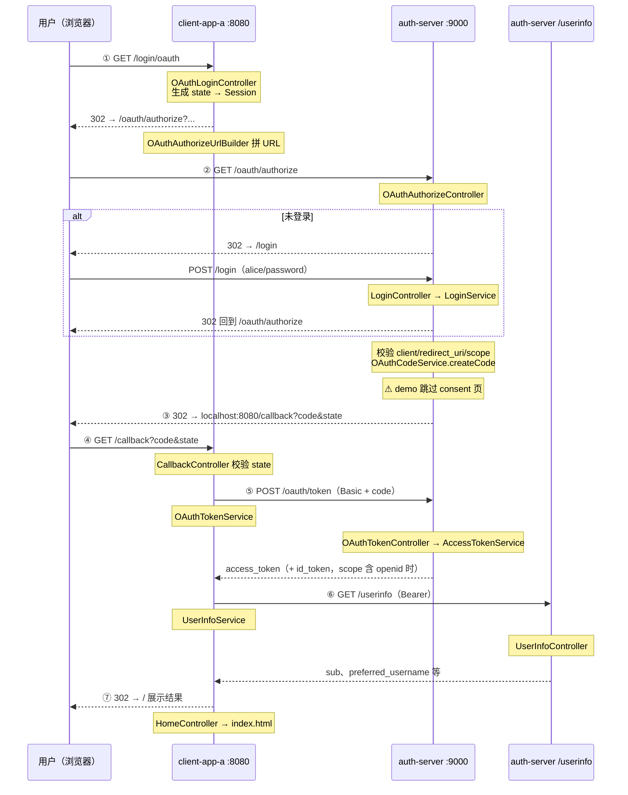

# OAuth2 核心原理

## 为什么需要 OAuth2

OAuth2 是在 RFC 6749 中定义的，开篇第一句就说明了它是**面向第三方应用的授权协议**。

如果你的系统不涉及第三方，其实根本不需要 OAuth2。

---

理解它的动机，用阮一峰的"快递员"比喻最直观：

> 你家有门禁，快递员每天来送货。你不可能把自己的密码告诉他——这样他权限太大，而且以后想收回权限还得改密码。你真正需要的是：给快递员一个"有限制的令牌"，他只能进门，不能做其他事，而且你随时可以让令牌失效。

对应到互联网上，比如 Travis-CI 要访问你的 GitHub 仓库，你不可能把 GitHub 密码给它。密码泄漏、权限范围、授权回收，这三个问题 OAuth2 都要解决。

---

**OAuth2 的核心思路：用 Token 代替密码**

| 对比维度 | 密码           | Token           |
| ---- | ------------ | --------------- |
| 有效期  | 长期，用户不改就不变   | 短期，到期自动失效       |
| 撤销   | 只能改密码，影响所有地方 | 可单独撤销，不影响其他     |
| 权限范围 | 完整权限         | 可以限制 scope，比如只读 |

## 核心角色

```
资源所有者（Resource Owner）   → 你自己，数据的主人
第三方应用（Client）           → Travis-CI、某网站
授权服务器（Authorization Server） → GitHub，负责发令牌
资源服务器（Resource Server）  → 存放资源的服务，可以和授权服务器是同一个
操作代理（User Agent）        → 浏览器、RPC Client 等
```

第三方应用在使用 OAuth2 之前，需要先去授权服务器**注册**，拿到：
- `client_id`：公开的应用标识，相当于"用户名"
- `client_secret`：只有应用自己知道的密钥，相当于"密码"，**绝不能暴露给前端**

## 四种授权模式
token换密码只是一种思路，具体如何实施，Oauth也进行了规定。OAuth2 一共提出了四种不同的授权方式。其中授权码模式是最严谨的，它考虑到了几乎所有敏感信息泄漏的预防和后果。

### 1. 授权码模式（最常用，最安全）

适用场景：有后端服务器的 Web 应用。



**关键请求参数：**

```
# 第一步：跳转到授权页（前端跳转）
GET https://github.com/login/oauth/authorize
  ?response_type=code
  &client_id=CLIENT_ID
  &redirect_uri=CALLBACK_URL
  &scope=read
  &state=RANDOM_STRING

# 第二步：后端用 code 换 token（后端直连，不经过浏览器）
POST https://github.com/login/oauth/access_token
  client_id=CLIENT_ID
  client_secret=CLIENT_SECRET
  grant_type=authorization_code
  code=AUTHORIZATION_CODE
  redirect_uri=CALLBACK_URL
```

响应（`refresh_token` 可选，授权服务器可不发）：

```json
{
  "access_token": "...",
  "token_type": "bearer",
  "expires_in": 7200,
  "refresh_token": "..."
}
```

> `access_token` 本身可以是不透明字符串，也可以是 JWT，规范没有强制格式。不透明 token 资源服务器通常要回源校验；JWT 可以本地验签，但撤销更难（见 Q3）。

#### 为什么这么设计？

**Q1：为什么不直接把密码给第三方应用？**

| 问题 | 后果 |
|---|---|
| 第三方被攻破 | 你的密码一起泄漏 |
| 权限范围无法控制 | 第三方有你的全部权限 |
| 无法单独撤权 | 只能改密码，影响所有第三方 |

OAuth2 用 token 代替密码，解决了以上三个问题：token 短期有效、scope 可限制、可单独撤销。

---

**Q2：为什么要先发 code，再用 code 换 token？直接返回 token 不行吗？**

这是授权码模式最核心的设计取舍：

```
如果直接在重定向 URL 里返回 token：
  https://a.com/callback?token=ACCESS_TOKEN   ← ❌

问题：URL 参数会出现在浏览器历史、服务器日志、Referer header 里
任何能读到这些的地方都能拿到 token
```

```
实际做法：先返回 code，再后端换 token：
  https://a.com/callback?code=XXXX           ← ✅

code 本身没有意义，没有 client_secret 换不了 token
client_secret 只在后端，前端和攻击者都看不到
```

两步换取 = 把"看得见的跳转"和"真正的凭证"分开，浏览器只经手 code，token 全程在后端流转。

---

**Q3：为什么 access_token 有效期要短，还要单独设计 refresh_token？**

OAuth2 有一个主要缺陷：**token 一旦发出，在过期前很难让它失效**（因为资源服务器通常只验证 token 本身，不会每次都回授权服务器查询状态）。

所以把 access_token 做成短期的（1-2 小时），就算泄漏，危害是有限的。

那为什么不干脆每次都重新走一遍授权流程？因为那需要用户重新确认，体验很差。

refresh_token 的作用：
- 有效期长（天/周级），但**只在后端和授权服务器之间**使用，不经过浏览器
- 用 refresh_token 续期时，授权服务器可以决定是否继续授权（比如用户撤权了，刷新就会失败）
- 如果 refresh_token 也泄漏了，危害比直接泄漏 access_token 大，但它从不经过前端，风险相对可控

---

**Q4：state 参数有什么用？**

防 CSRF 攻击。流程开始时后端生成随机 state 存入 session，callback 时验证 state 是否一致。否则攻击者可以构造一个带恶意 code 的回调链接骗你点击。

---

### 2. 隐式授权模式（不推荐，OAuth 2.1 已废弃）

适用场景：纯前端 SPA，没有后端服务器（历史方案，新项目不应使用）。



token 直接返回给浏览器，省掉了后端换取这一步。代价是 token 暴露在前端，不发 refresh_token，只能在 session 级别有效。

**为什么用 Fragment（`#`）而不是 Query String（`?`）？**

浏览器在跳转时，`#` 后面的部分不会随 HTTP 请求发到服务器，只能由前端 JS 读取，减少了 token 在中间链路被截获的风险。但本质上 token 还是在前端，安全性有限。

**为什么现代应用不推荐用这个模式？**

前端能拿到 token，浏览器插件、XSS 攻击、浏览器历史记录都可能泄漏它。OAuth 2.1 已废弃隐式模式；现代 SPA 应使用**授权码 + PKCE**——仍走授权码流程，通过 `code_verifier` / `code_challenge` 证明请求方合法，公有客户端无需 `client_secret`。

---

### 3. 密码模式（不推荐，除非高度信任的内部系统）



```
POST https://auth.com/token
  grant_type=password
  username=USER
  password=PASS
  client_id=CLIENT_ID
```

**为什么不推荐？**

用户把密码明文交给第三方，安全性完全依赖第三方是否可信，OAuth2 规范无法技术上约束第三方不保存密码。

**什么时候可以用？**

凤凰架构给出了合理场景：当"第三方"只是系统自己的子模块（比如你自己的前端 + 自己的 auth 服务），密码在自己系统内部流转，这时密码模式是可以接受的——本质上它就是一个正常的账号密码登录接口，只是套了 OAuth2 的格式。

---

### 4. 客户端模式（服务间调用）

没有用户参与，应用直接以自己的身份换 token。



```
POST https://auth.com/token
  grant_type=client_credentials
  client_id=CLIENT_ID
  client_secret=CLIENT_SECRET
```

适用场景：微服务之间的调用认证、后台定时任务（比如"清理超时订单"这个服务需要以自己的名义操作所有用户的订单，而不是以某个用户身份）。

---

### 使用 token 访问资源

拿到 token 之后，所有 API 请求带上：

```
Authorization: Bearer ACCESS_TOKEN
```

---

---

## OAuth2 vs SSO

这两个是不同维度的东西，经常被混淆：

```
OAuth2 → 解决"第三方应用能否代表用户访问某个资源"（授权）
SSO    → 解决"用户登录一次，多个系统都认这个登录状态"（认证）
OIDC   → 在 OAuth2 上补了身份层，才真正适合做登录 / SSO
```

比如"用微信登录某 App"这个流程：
- OAuth2 负责的部分：让 App 拿到访问微信资源的授权，以及平台自定义的用户标识（openid 等）
- App 登录态的建立：是 App 自己发的 session/cookie，和 OAuth2 无关

---

## 本仓库对照（custom-oauth-demo）

本仓库 [`custom-oauth-demo`](../README.md) 手写实现了上文授权码模式，不依赖 Spring Authorization Server。下面用**同一套步骤图**逐步对照代码。

### 运行与角色映射

```bash
# 终端 1：授权服务器
mvn -pl custom-oauth-demo/auth-server spring-boot:run   # :9000

# 终端 2：客户端 A
mvn -pl custom-oauth-demo/client-app-a spring-boot:run  # :8080

# 终端 3：客户端 B（SSO 演示）
mvn -pl custom-oauth-demo/client-app-b spring-boot:run  # :8081
```

浏览器访问 http://localhost:8080/ ，点击 OAuth 登录。

| 步骤图角色 | 本 demo | 说明 |
|-----------|---------|------|
| U 用户（浏览器） | 浏览器 | 只经手跳转 URL，不接触 `client_secret` |
| C 第三方应用（后端） | `client-app-a` :8080、`client-app-b` :8081 | 发起授权、校验 state、后端换票 |
| A 授权服务器 | `auth-server` :9000 | 登录、发 code、换 token、统一门户 `/portal` |
| R 资源服务器 | `auth-server` :9000 | 与 A 同进程，`GET /userinfo` 校验 Bearer token |

演示凭据：用户 `alice` / `password`；客户端 A `demo-client` / `demo-secret`；客户端 B `demo-client-b` / `demo-secret-b`；scope `openid profile`。

### 授权码流程逐步对照



逐步说明：

**① 客户端发起授权（对应 Q4 state）**

- 用户点击登录 → `OAuthLoginController.oauthLogin`
- `OAuthAuthorizeUrlBuilder.newState()` 生成 UUID，写入 Session
- 302 到 `http://localhost:9000/oauth/authorize?response_type=code&client_id=demo-client&redirect_uri=...&scope=openid profile&state=...`

**② 授权服务器处理授权请求**

- `OAuthAuthorizeController.authorize` 校验 `response_type=code`
- 未登录：保存原 URL 到 Session（`OAUTH_PENDING`），302 到 `/login`；`LoginController` 验证 `alice/password` 后跳回
- 已登录：`OAuthClientService` 校验 client_id、redirect_uri、scope → `OAuthCodeService.createCode()` 生成一次性 code
- demo **无 consent 页**，登录即视为授权（生产环境通常需要用户确认 scope）

**③ 浏览器携带 code 回到客户端**

- 302 → `http://localhost:8080/callback?code=...&state=...`
- code 本身无意义，没有 `client_secret` 换不了 token（对应上文 Q2）

**④ 客户端校验 state**

- `CallbackController.callback` 比对 Session 中的 state 与回调参数
- 不一致则拒绝，防 CSRF（对应上文 Q4）

**⑤ 后端用 code 换 token（浏览器不参与）**

- `OAuthTokenService.exchangeCode` → `POST http://localhost:9000/oauth/token`
- `Authorization: Basic base64(demo-client:demo-secret)`，body 带 `grant_type=authorization_code&code=...&redirect_uri=...`
- 授权服 `OAuthTokenController` 校验 Basic 凭证，`OAuthCodeService.validateForToken` 再次校验 redirect_uri 并标记 code 已用
- 返回 `access_token`；scope 含 `openid` 时还返回 `id_token`（见 [[2、oauth OIDC]]）
- demo **未返回 refresh_token**（对应上文 Q3，过期需重新授权）

**⑥ 用 access_token 访问资源**

- `UserInfoService.fetchUserInfo` → `GET /userinfo`，Header `Authorization: Bearer ...`
- 授权服 `UserInfoController` 校验 token 有效性，返回用户 claims
- demo 的 access_token 是**不透明字符串**（内存存储），非 JWT

**⑦ 呈现结果**

- token 与 userinfo 写入 Session，`HomeController` 渲染首页

### demo 刻意省略（读代码时留意）

| 省略项 | 说明 |
|--------|------|
| consent 页 | 登录后直接发 code |
| refresh_token | 无法静默续期 |
| PKCE | 机密客户端 demo，未演示公有客户端场景 |
| id_token 验签 | 客户端只存 Session 展示，未验证 JWT 签名 |
| 标准 `/oauth2/*` 路径 | 手写为 `/oauth/*` |
| HTTPS / 持久化存储 | 本地 HTTP + 内存仓库，重启失效 |

更完整的代码链路见 [README](../README.md) 的「一次完整请求的代码链路」一节。

### SSO 场景验证

用户在系统 A 完成 OAuth 登录后，auth-server 的 `SESSION_LOGIN_USER` 已写入浏览器 Cookie（`:9000`）。此时从统一门户 http://localhost:9000/portal 点击「进入系统 B」：

1. 浏览器跳转到 `client-app-b` 的 `/login/oauth`，再 302 到 auth-server `/oauth/authorize`（`client_id=demo-client-b`）。
2. `OAuthAuthorizeController.authorize` 检测到 `loginUser != null`，**跳过** `/login`，直接 `OAuthCodeService.createCode()` 并重定向回 B。
3. B 的 `CallbackController` 换票、拉 userinfo，建立 B 本地 Session。

与 sa-token demo 相同：SSO 根基是**认证中心 Session**；custom 版为手写 `/oauth/authorize`，无 consent 页，已登录即静默发 code。未实现 OIDC `prompt=none` 参数解析；门户 `POST /logout` 可演示全局登出。

---

## 参考

- [[2、oauth OIDC]] - OIDC 身份层
- [本仓库 README](../README.md) - 三套 demo 运行方式与代码对照
- [凤凰架构 - 授权](https://icyfenix.cn/architect-perspective/general-architecture/system-security/authorization.html#oauth2)
- [阮一峰 - OAuth 2.0 的一个简单解释](https://www.ruanyifeng.com/blog/2019/04/oauth_design.html)
- [阮一峰 - OAuth 2.0 的四种方式](https://www.ruanyifeng.com/blog/2019/04/oauth-grant-types.html)
