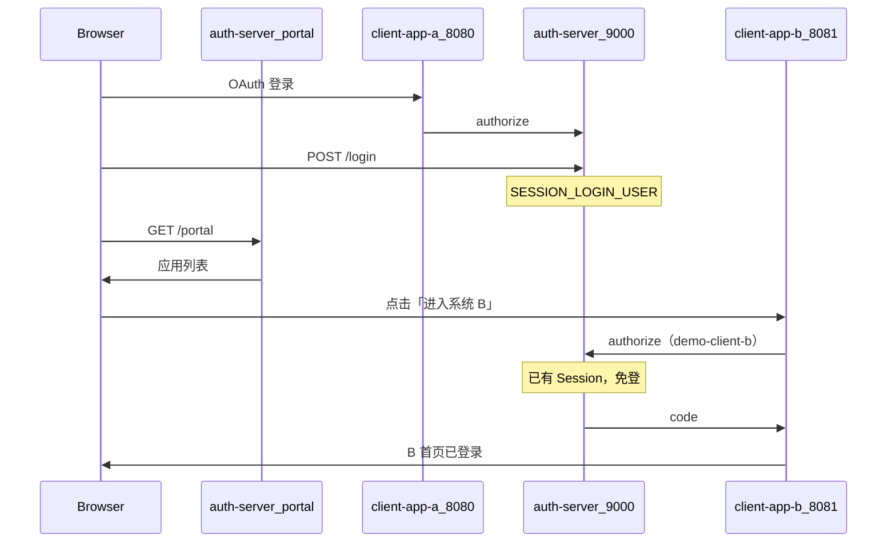

# OIDC：在 OAuth2 上补一层身份认证

## OAuth2 的局限

OAuth2 解决的是"授权"问题，本质是：**让第三方应用能代表用户访问某些资源**。

但它没有定义"用户是谁"这件事。

拿授权码模式举例，第三方应用拿到 `access_token` 之后，只知道"我有权限访问某些资源"，但：
- 这个 token 对应的是哪个用户？
- 这个用户叫什么名字、邮箱是什么？
- 我该怎么把它和我系统里的账号关联起来？

OAuth2 对这些问题没有统一的规定。各家平台的做法不一，比如用 token 去访问 `/userinfo` 接口，但字段格式各不相同。

---

**OIDC = OAuth2 + 标准化的身份层**

OpenID Connect（OIDC）就是为了解决这个问题：在 OAuth2 授权流程之上，**标准化**用户身份的传递方式——规定 `id_token` 必须是 JWT，并规范 `/userinfo` 端点的用法。

> 注意：OIDC 只规定 `id_token` 为 JWT；`access_token` 仍可以是不透明字符串或 JWT，与 OAuth2 一样没有强制格式。

## OIDC 新增了什么

相比 OAuth2，OIDC 主要增加了三样东西：

| 新增内容 | 说明 |
|---|---|
| `id_token` | 一个 JWT，包含用户身份信息，随 `access_token` 一起返回 |
| `scope=openid` | 触发 OIDC 流程的魔法参数，加上它才会返回 `id_token` |
| `/userinfo` 端点 | 标准化的用户信息接口，用 `access_token` 访问 |

**核心：ID Token 是什么**

`id_token` 是一个 JWT（JSON Web Token），解码后大概长这样：

```json
{
  "iss": "https://accounts.google.com",   // 谁发的
  "sub": "1234567890",                    // 用户唯一标识
  "aud": "your-client-id",               // 给谁的（client_id）
  "exp": 1716912000,                      // 过期时间
  "iat": 1716908400,                      // 签发时间
  "name": "张三",
  "email": "zhangsan@example.com",
  "picture": "https://..."
}
```

`sub`（subject）是用户在这个授权服务器上的唯一标识，相当于 openid。

---

## OIDC 的完整流程（授权码模式）

和 OAuth2 授权码流程几乎一样，区别只在 scope 里加了 `openid`，响应里多了 `id_token`。

```
① 跳转授权页，scope 里加上 openid
GET https://auth.server.com/authorize
  ?response_type=code
  &client_id=CLIENT_ID
  &redirect_uri=CALLBACK
  &scope=openid profile email    ← 关键

② 用户同意，返回 code

③ 后端用 code 换 token（和 OAuth2 一样）

④ 响应中多了 id_token：
{
  "access_token": "...",
  "id_token": "eyJhbGc...",      ← 新增
  "token_type": "bearer",
  "expires_in": 3600
}

⑤ 客户端**验证** id_token（不是只解码），拿到用户信息
   也可以用 access_token 访问 /userinfo 端点
```

验证 id_token 时至少检查：

- **签名**：用认证中心公钥（`/oauth2/jwks`）或约定的对称密钥
- **`iss`**：签发者是否与预期一致
- **`aud`**：是否包含本应用的 `client_id`
- **`exp`**：是否过期
- **`nonce`**（若授权请求中发送了）：防重放

OIDC 常见 scope：
- `openid`：必须有，触发 OIDC
- `profile`：name、picture、locale 等
- `email`：email 和 email_verified
- `phone`：手机号

---

## OIDC 如何实现 SSO

OIDC 是目前主流的 SSO 实现方案。多个业务系统共用一个**认证中心**（OIDC Provider）：

```
用户第一次登录
  → 跳转到认证中心
  → 认证中心验证身份，建立全局 session
  → 返回 code 给业务系统 A
  → A 换取 id_token，创建本地 session

用户访问业务系统 B
  → 跳转到认证中心
  → 认证中心发现有全局 session，直接静默授权
  → 返回 code 给 B（用户无感知）
  → B 换取 id_token，创建本地 session
```

全局登录态由认证中心维护，业务系统只负责本地 session。登出时需要通知认证中心注销全局 session，否则其他系统还是登录状态。

---

## 用微信登录（类比 OIDC 流程，但不是标准 OIDC）

微信开放平台提供的是 **OAuth2 风格**的授权，流程上可以和 OIDC 对照理解，但**不是标准 OIDC Provider**：

| 对比项 | 标准 OIDC | 微信开放平台 |
|--------|-----------|-------------|
| `scope=openid` | 触发 OIDC，返回 `id_token` | 无此语义；返回的是微信 `openid` 字段 |
| `id_token`（JWT） | 有，含 `sub` 等标准 claim | **无** |
| 发现文档 | `/.well-known/openid-configuration` | **无** |
| 用户信息 | 标准 `/userinfo` | 微信自定义接口（如 `/sns/userinfo`） |

```
① 用户点击「微信登录」
② 跳转到微信授权页
③ 微信确认用户身份，返回 code
④ 后端用 code 换取 access_token（微信不发标准 id_token）
⑤ 用 access_token 请求微信 userinfo，拿到 openid / unionid
⑥ 根据 openid 创建或绑定本地用户
⑦ 业务系统自己给用户发 session / cookie
```

微信在这里的角色是**授权服务器 + 自定义身份接口**，你的 App 是依赖方（Relying Party）。说「OIDC 视角」是指流程步骤类似，不要把它当成标准 OIDC Provider。

---

## OIDC vs OAuth2 对比

| 维度 | OAuth2 | OIDC |
|---|---|---|
| 解决的问题 | 授权（你能做什么） | 认证（你是谁） |
| 返回内容 | access_token | access_token + id_token |
| 用户身份 | 没有标准规定 | sub 字段统一标识 |
| 适合场景 | 第三方应用访问资源 | 登录、SSO |

> OIDC 是"站在 OAuth2 肩膀上"的身份层。OAuth2 负责"你有没有权限"，OIDC 负责"你是谁"。两者一起才构成一个完整的认证授权体系。

---

## 本仓库对照

### 三套 demo 的 OIDC 完成度

| 能力 | custom-oauth-demo | spring-security-oauth-demo | sa-token-oauth-sso-demo |
|------|-------------------|---------------------------|------------------------|
| `scope=openid` | ✅ | ✅ | ✅（Sa-Token 语义） |
| `id_token`（JWT） | ✅ HS256 | ✅ RS256（框架签发） | ❌ 无 JWT，只有 `openid` 字符串 |
| `/userinfo` | ✅ `GET` + Bearer | ✅ 框架端点 + 业务 API（:8090） | ✅ `POST` + form `access_token` |
| OIDC Discovery | ✅ 部分（无 jwks_uri） | ✅ 完整 | ❌ |
| SSO 静默授权 | ✅ auth-server Session + `/portal` | ❌（单客户端 demo） | ✅ 中心 Session + autoConfirm |
| 账号绑定 | ❌ | ❌ | ✅ system-b（`OAuthUserLink`） |

建议学习路径：**custom** 跟通流程 + SSO 门户 → **spring-security** 看标准 OIDC → **sa-token** 看多系统 SSO + 账号绑定。

### custom-oauth-demo：OIDC 相关代码

运行：`auth-server :9000` + `client-app-a :8080` + `client-app-b :8081`，scope 配 `openid profile`。

| OIDC 步骤 | 实现 | 核心类 |
|-----------|------|--------|
| 授权请求带 `openid` scope | ✅ | 客户端 `OAuthAuthorizeUrlBuilder` |
| token 响应附带 `id_token` | ✅ scope 含 openid 时 | 授权服 `AccessTokenService` → `IdTokenService` |
| 签发 JWT（HS256） | ✅ | `IdTokenService` / `JwtUtil` |
| RP 验证 id_token 签名 | ❌ | 客户端只存 Session 展示，**未验签** |
| `GET /userinfo` + Bearer | ✅ | `UserInfoController` |
| `GET /.well-known/openid-configuration` | ✅ 部分字段 | `OpenIdConfigurationController` |

换票后客户端链路：`CallbackController` → `OAuthTokenService`（拿 token + id_token）→ `UserInfoService`（Bearer 调 userinfo）→ Session → 首页展示。

**demo 刻意省略**：id_token 验签、JWKS、`nonce`、consent 页、跨 RP 单点登出联动、`prompt=none`。

#### SSO 演示（custom-oauth-demo）



验证步骤见 [README](../README.md)「SSO 验证（custom-oauth-demo）」：门户路径 `/portal`；核心代码 `PortalController`、`OAuthAuthorizeController` 已登录分支。与 sa-token 相同依赖中心 Session；custom 为手写 authorize，非 Sa-Token `autoConfirm`。

### spring-security-oauth-demo：完整 OIDC

- 授权服 `:9000` 开启 `authorizationServer.oidc(...)`，自动暴露标准 `/oauth2/*`、discovery、jwks。
- 客户端 `:8080` 用 `oauth2Login`，框架自动处理 code 换 token、id_token 解析。
- 注意有两个 `/userinfo` 概念：**:9000** 是 OIDC 标准端点，**:8090** 是业务资源 API（读 JWT 自定义 claim），不要混淆。

### sa-token-oauth-sso-demo：类 SSO，非完整 OIDC

- 认证中心 `:9100`，system-a `:9201`、system-b `:9202`。
- scope 为 `openid userinfo`，但身份主键来自 token 里的 `openid` 字符串和 `UserinfoScopeHandler` 写入的 extraData，**没有标准 id_token JWT**。
- SSO 机制：用户在中心 `StpUtil.login` 后，浏览器持有中心 Cookie；第二个系统再跳 `/oauth2/authorize` 时中心已有会话 + `setIsAutoConfirm(true)`，跳过登录页——不是 OIDC 的 `prompt=none`。
- system-b 演示账号绑定：`alice` 同名自动绑定，`bob_local` 需走 `/bind` 手动关联。

---

## 参考

- [[1、oauth]] - OAuth2 基础
- [[3、oauth实战（结合框架）]] - Sa-Token 接入（待与仓库对齐）
- [本仓库 README](../README.md) - 三套 demo 运行方式与代码对照
- [Sa-Token OAuth2/OIDC 文档](https://sa-token.cc/doc.html#/oauth2/oauth2-oidc)
