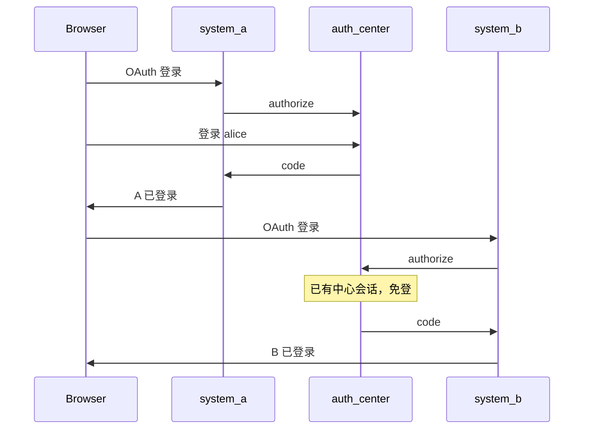

# Sa-Token OAuth2 认证中心 + SSO

基于 **Sa-Token OAuth2 Server** 的统一认证中心，配合两个业务系统演示 OAuth 授权码登录与 SSO。

## 架构

```text
auth-center :9100   ← Sa-Token OAuth2 + 全局登录会话（SSO 根基）
    ↑ OAuth 授权码
system-a    :9201   ← 新建系统，仅 OAuth
system-b    :9202   ← 已建系统，本地登录 + OAuth + 账号绑定
```



## 运行

```bash
mvn -pl sa-token-oauth-sso-demo/auth-center spring-boot:run
mvn -pl sa-token-oauth-sso-demo/system-a spring-boot:run
mvn -pl sa-token-oauth-sso-demo/system-b spring-boot:run
```

## 账号与客户端

| 用途 | 值 |
|------|-----|
| 中心用户 | `alice` / `password`，`bob` / `password` |
| system-a client | `system-a` / `system-a-secret` |
| system-b client | `system-b` / `system-b-secret` |
| B 本地用户 | `bob_local` / `password`（与中心 `bob` 不同名，用于演示绑定） |
| B 本地用户 | `alice` / `password`（与中心同名，OAuth 自动绑定） |

## 验证步骤

1. **OAuth 登录 A**：http://localhost:9201 → 统一认证登录 → 中心输入 `alice`/`password` → A 首页显示 loginId。
2. **SSO 进 B**：http://localhost:9202 → 统一认证登录 → 应直接回 B，不再出现中心登录页。
3. **B 本地登录**：`bob_local` / `password`，与 OAuth 态独立。
4. **账号绑定**：中心用 `bob` OAuth 登录 B，跳转 `/bind`，输入 `bob_local`/`password` 完成绑定；`alice` OAuth 会因用户名相同自动绑定本地 `alice`。

## 与仓库其他 demo 的关系

| demo | 学习重点 |
|------|----------|
| custom-oauth-demo | RFC 逐步手写 |
| spring-security-oauth-demo | Spring 标准 OAuth/OIDC |
| sa-token-oauth-sso-demo | Sa-Token OAuth2 中心 + 多 RP + SSO + 遗留绑定 |

## 关键代码

- 中心：`auth-center/.../SaOAuth2ServerController.java`、`ClientRegistry.java`
- 客户端换票：`system-a/.../SaOAuthTokenClient.java`（解析 SaResult `code=200` 的 `data`）
- B 绑定：`system-b/.../OAuthLoginService.java`

## 说明

- 客户端**未使用** Spring `oauth2-client`，因 Sa-Token 接口响应为 `SaResult` 包装。
- 中心 `setIsAutoConfirm(true)`，已登录用户访问第二套系统时跳过授权确认页。
- 第一版会话为内存，未实现单点注销与 Redis。
